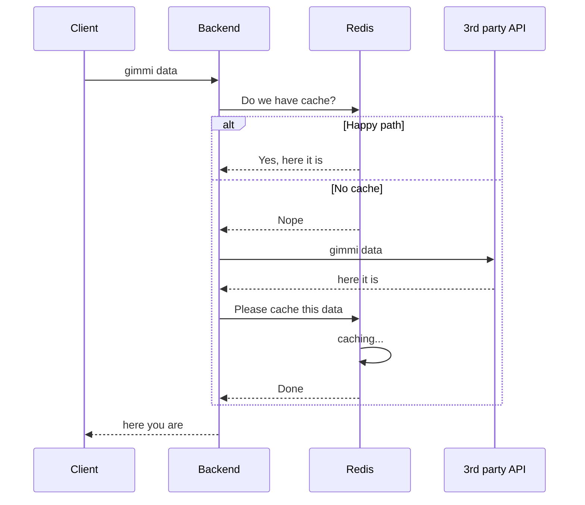

# Demo

```mermaid
sequenceDiagram
    participant FE as Client
    participant BE as Backend
    participant Redis
    participant API as 3rd party API

    FE->>BE: gimmi data
    BE->>Redis: Do we have cache?

    alt Happy path
        Redis-->>BE: Yes, here it is
    else No cache
        Redis-->>BE: Nope
        BE->>API: gimmi data
        API-->>BE: here it is
        BE->>Redis: Please cache this data
        Redis->>Redis: caching...
        Redis-->>BE: Done
    end

    BE-->>FE: here you are
```
